  

<h1 align="center">Hi, I'm Khulaifi 👋</h1>

  Mahasiswa yang lagi belajar web development. 
  Suka bikin project kecil pakai <b>HTML</b>, <b>CSS</b>, dan <b>PHP</b> — dan vibe coding.

  
  
  

---

### 🌱 What I'm doing

- Belajar web development, satu project kecil setiap kali
- Suka layout yang bersih dan interface yang simpel
- Learn → build → break → fix → improve

   
  

